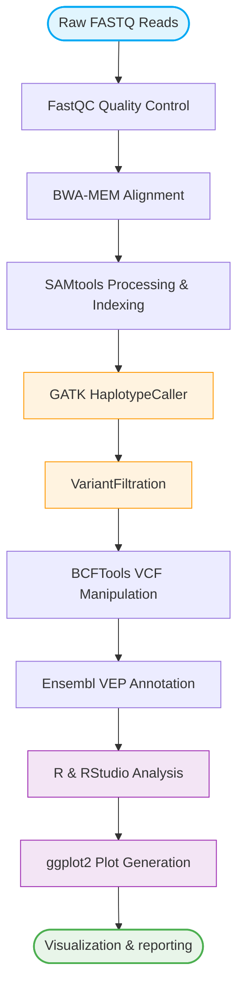
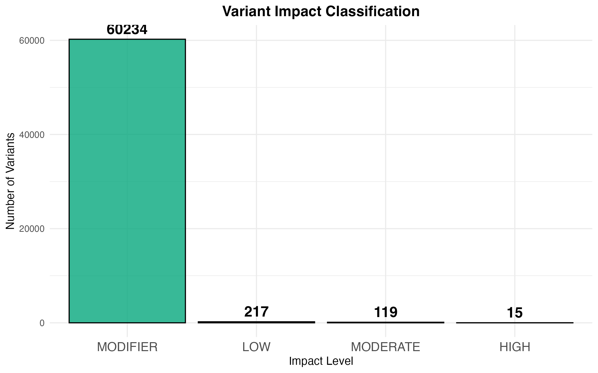
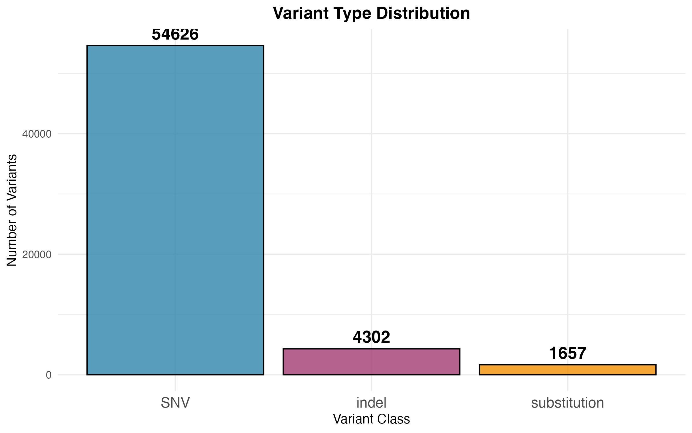
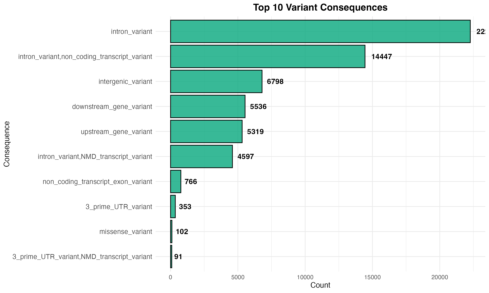
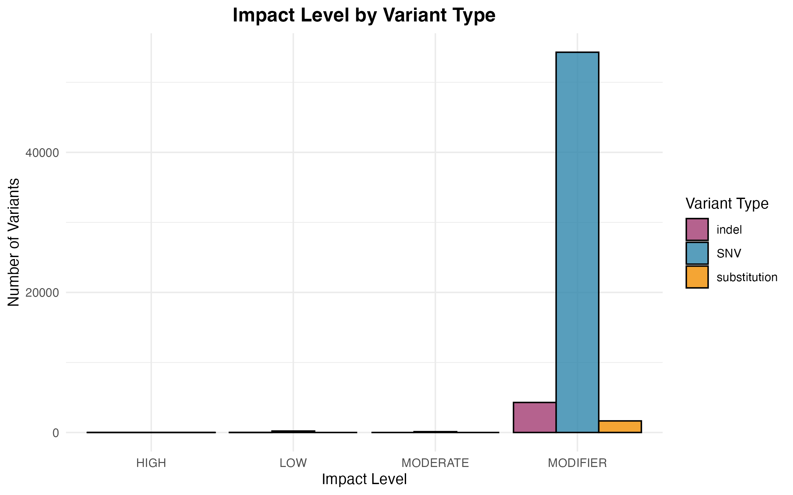
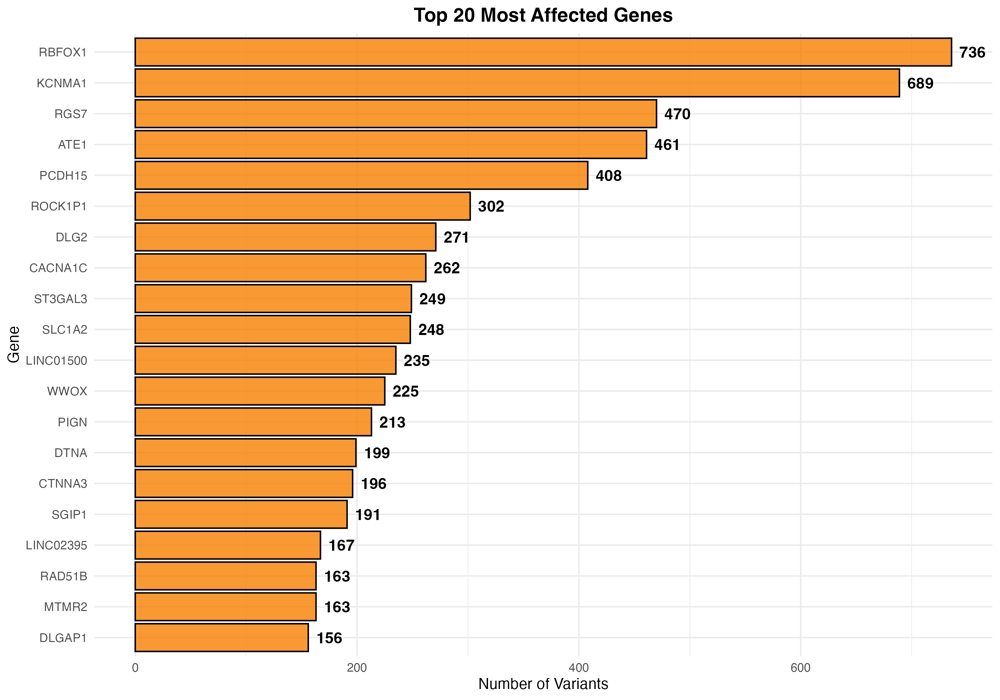

# 🧬 Human Low-Coverage WGS Variant Calling (SRR062634)
## 📌 Overview

This project performs a complete  Whole Genome Sequencing (WGS) variant calling and functional annotation analysis using the low-coverage human dataset SRR062634 from the 1000 Genomes Project. The workflow includes raw data retrieval, reference genome alignment, duplicate marking, variant calling, variant effect prediction, and variant visualization.
---
## 📂 Dataset Information

* **Dataset**: SRR062634 (Experiment: SRX025016)
* **Source**: NCBI SRA
* **Organism**: *Homo sapiens* 
* **Study Type**: Whole Genome Sequencing (WGS)
* **Conditions**: Low-coverage Population Profiling (GBR)
* **Samples**: 1 (Cell Line: Coriell HG00096)
* **Sequencing Platform**: Illumina Genome Analyzer II
* **Library Strategy**: WGS (Whole Genome Sequencing)
* **Library Layout**: PAIRED
---
## 🧬 Workflow

---
### 🛠️ Tools and Software
| Tool | Purpose |
|---|---|
| Linux | Environment |
| Bash | Pipeline execution |
| sra-tools | Fastq retrieval |
| FastQC | Quality control |
| fastp | Read trimming |
| BWA | Sequence alignment |
| SAMtools | BAM processing |
| Picard | Duplicate marking |
| GATK4 | Variant calling |
| Ensembl VEP | Variant annotation |
| R | Statistical analysis |
| ggplot2 | Plotting |
---
## 📁 Repository Structure

```text
WGS-Variant-Calling-Pipeline/
├── scripts/                
├── R_scripts/              
├── data/                   
├── qc/                     
├── qc_trimmed/             
├── alignment/              
├── results/                
├── annotation/             
├── figures/                
│   ├── 01_impact_distribution.png
│   ├── 02_variant_class_distribution.png
│   ├── 03_top_consequences.png
│   ├── 04_impact_vs_class.png
│   └── 05_top_genes.png
├── report/                 
├── README.md               
└── variant_analysis_report.txt  
```
---
## 🧬 Genomic Variant Analysis

Variant calling was performed using **GATK HaplotypeCaller** and hard-filtered via **VariantFiltration** to isolate high-confidence germline variants across the genome.

## 📊 Visualization Results

### Variant Impact Distribution



### Variant Class Distribution



### Top Variant Consequences



### Impact vs Variant Class



### Top Genes with Variants


---
## 🧬 Key Skills Demonstrated

- NGS data analysis
- Whole Exome Sequencing workflow
- Variant calling pipeline
- VCF file analysis
- Variant annotation
- Linux command line
- R-based data visualization
---
## 👩‍💻 Author

Megha Patil  
Bioinformatics | NGS Data Analysis
